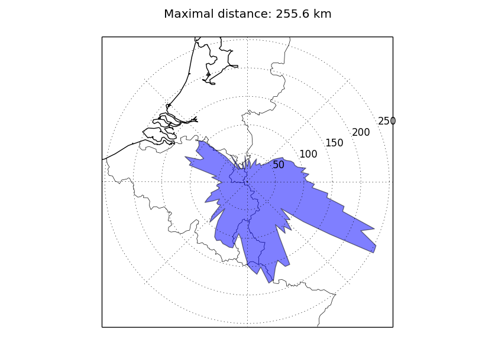

Examples of py1090
==================

Recording messages to a file
----------------------------

This example reads BaseStation messages from a TCP server and writes them to a separate file if they contain position information.

.. literalinclude:: ../../examples/record_raw_to_file.py
	:tab-width: 4
	:lines: 3-

An excerpt of a generated file looks like this: ::

	MSG,3,111,11111,502C8F,111111,2015/05/01,20:28:11.080,2015/05/01,20:28:11.071,,33975,,,50.33498,5.93336,,,,,,0
	MSG,3,111,11111,4B1619,111111,2015/05/01,20:28:11.348,2015/05/01,20:28:11.333,,33000,,,50.37995,5.95860,,,,,,0
	MSG,3,111,11111,471F84,111111,2015/05/01,20:28:11.518,2015/05/01,20:28:11.466,,35000,,,50.64618,5.59360,,,,,,0
	MSG,3,111,11111,4CA27D,111111,2015/05/01,20:28:11.549,2015/05/01,20:28:11.530,,21150,,,50.48991,5.92490,,,,,,0
	MSG,3,111,11111,47875C,111111,2015/05/01,20:28:11.912,2015/05/01,20:28:11.859,,21125,,,50.82724,5.91695,,,,,,0
	MSG,3,111,11111,471F84,111111,2015/05/01,20:28:11.978,2015/05/01,20:28:11.924,,35000,,,50.64595,5.59508,,,,,,0
	MSG,3,111,11111,502C8F,111111,2015/05/01,20:28:12.020,2015/05/01,20:28:11.989,,33975,,,50.33592,5.93110,,,,,,0
	...

These files usually are multiple Megabytes large.

Plotting paths on a Matplotlib Basemap map
------------------------------------------

This example takes an input file generated in the first example and plots the recorded paths on a map, using the :py:mod:`mpl_toolkits.basemap` module.

.. literalinclude:: ../../examples/plot_basemap.py
	:tab-width: 4
	:lines: 3-

Creating a polar antenna plot using Matplotlib
----------------------------------------------

This example takes an input file generated in the first example and plots the maximum distances in each direction, also using the :py:mod:`mpl_toolkits.basemap` module.

.. literalinclude:: ../../examples/plot_basemap_polar.py
	:tab-width: 4
	:lines: 3-
